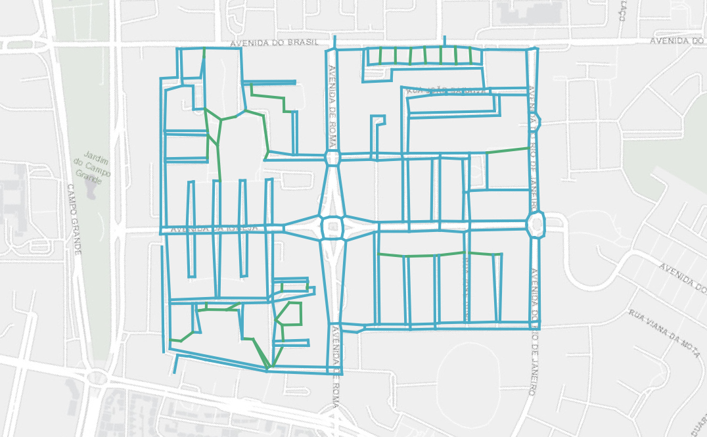

# Mapping a pedestrian network

This repository aims to document the creation of a pedestrian network for the [Alvalade neighborhood, in Lisbon](https://www.google.com/maps/place/Alvalade,+Lisbon/@38.7549497,-9.1655542,14z/).

It was created within the scope of the development of a [Sustainable Urban Mobility Plan](https://urban-mobility-observatory.transport.ec.europa.eu/sustainable-urban-mobility-plans_en) focused on accessibility. This work was proposed by [Professor Filipe Moura](https://fenix.tecnico.ulisboa.pt/homepage/ist14188) for the [Mobility Urban Manamagement](https://fenix.tecnico.ulisboa.pt/disciplinas/GMU-2/2023-2024/2-semestre) signature.

## Summary

0. [Preparation](./0_Preparation/README.md)

## Authors

- [Gonçalo Matos](https://www.linkedin.com/in/goncalofmatos/)
- [Madalena Santos](https://www.linkedin.com/in/madalena-ayala-santos/)
- Miguel Diogo
- [Vitor Pereira](https://www.linkedin.com/in/v%C3%ADtor-pereira-25506020a/)